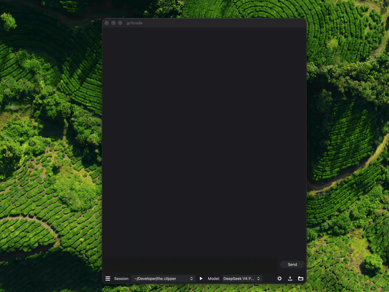

# Gritcode

**The AI coding agent that fits in 10 MB.** A native desktop agent harness for DeepSeek V4, written in C++20 with wxWidgets. There's no Electron and no browser tab.

**[gritcode.ai](https://gritcode.ai)** · [Download](https://github.com/lszl84/gritcode/releases/latest) · [Features](https://gritcode.ai/features/) · [Compare](https://gritcode.ai/compare/) · [♥ Sponsor](https://gritcode.ai/sponsor/)

Runs [DeepSeek](https://platform.deepseek.com/) V4 Pro and V4.1 Flash with your API key, or free models through the [Kilo Gateway](https://kilo.ai/docs/gateway) with no key and no sign-up. It can also run Claude through your own [Claude Code](#claude) install.



## Download

| Platform | Package | Requirements |
|---|---|---|
| macOS | `.dmg` (signed) | macOS 14 or later, Apple Silicon |
| Linux | `.deb` | Ubuntu 24.04 or later / Debian (built on Ubuntu 24.04) |

Get both from the [latest release](https://github.com/lszl84/gritcode/releases/latest). On other distributions, [build from source](#build-from-source).

## Features

- **An agent with real tools:** bash, read, write and edit files, list, grep, web search and URL fetch, with collapsible tool-call cards and thinking blocks
- **▶ Play:** the agent saves your project's run command, then one click builds and runs it with no AI round-trip. Output lands in the chat.
- **Built-in editor:** a file tree plus tree-sitter syntax highlighting, smart indentation and save
- **Sessions:** per-project history in SQLite. Export a session to a `.gritsession` file (images included) and replay its prompts in a new project.
- **Cross-project memory:** full-text search over past sessions, available to the agent through `grit_history_search` and `grit_history_fetch`
- **Cheap long sessions:** compaction only near the context limit, a token-budgeted tail and chained summaries
- **Vision:** drag screenshots into the message box
- **Streaming markdown:** headings, tables and code blocks render live
- **Native:** the Tahoe look on macOS and GTK on Linux, following your dark/light theme. API keys are stored in the OS keyring.

## Small on purpose

| | Gritcode | OpenCode (TUI) | Claude desktop | Cursor |
|---|---|---|---|---|
| App size on disk | **10.5 MB** | 143 MB | 892 MB | 1.36 GB |
| RAM at rest | **58 MB** | 383 MB | ~1.8 GB | ~1.6 GB |

<sub>Measured on an Apple Silicon Mac on 14 Sep 2026 (OpenCode 1.18.30). RAM is the macOS physical memory footprint summed over each app's processes, while idle. More at [gritcode.ai/compare](https://gritcode.ai/compare/).</sub>

## Build from source

```bash
git clone https://github.com/lszl84/gritcode.git && cd gritcode

# Linux (Debian/Ubuntu)
sudo apt install build-essential cmake ninja-build pkg-config \
    libwxgtk3.2-dev libgtk-3-dev libcurl4-openssl-dev \
    libsqlite3-dev libsecret-1-dev
cmake --preset release
cmake --build --preset release
./build/gritcode

# macOS
brew install cmake ninja
cmake --preset release
cmake --build --preset release
open ./build/gritcode.app
```

On other Linux distributions, install the equivalent development packages for wxWidgets 3.2 (GTK 3), GTK 3, libcurl, SQLite and libsecret. On macOS, wxWidgets is built statically from source, so the `.app` has no Homebrew dependencies.

## API keys

Click the ⚙ gear button in the bottom toolbar to open Settings, then paste your DeepSeek API key ([get one here](https://platform.deepseek.com/)). Keys are stored in the OS keyring: the macOS Keychain or the Linux Secret Service. Kilo Free needs no key.

## Claude

The Model dropdown also offers **Claude (Opus 5.5)** and **Claude (Sonnet 5)**. These run your installed [Claude Code](https://code.claude.com/docs/en/setup) (the `claude` command) headlessly, so you need Claude Code installed and signed in: run `claude` once in a terminal and log in. Gritcode never sees your Claude credentials; usage goes to your own Claude account or API key.

With Claude selected, Claude Code runs its own agent loop and tools (Bash, Read, Edit, …), and Gritcode shows them in the chat. As with Gritcode's own agent, tools run without confirmation prompts. The ▶ Play button works the same with Claude: Gritcode gives Claude its `run_project` tool so it can set up the run command. Each Gritcode session resumes the same Claude Code session, and when you switch models mid-session the other model gets a transcript of what happened. Claude's effort level is in Settings.

## Support Gritcode

Gritcode is free, open source and built by one developer. If it saves you time:

- ♥ [Sponsor the project on GitHub Sponsors](https://github.com/sponsors/lszl84)
- Support the author on [Patreon](https://patreon.com/LukeDevMindscape)
- ⭐ Star the repo and tell a friend

## License

GPLv3. See [LICENSE](LICENSE).
